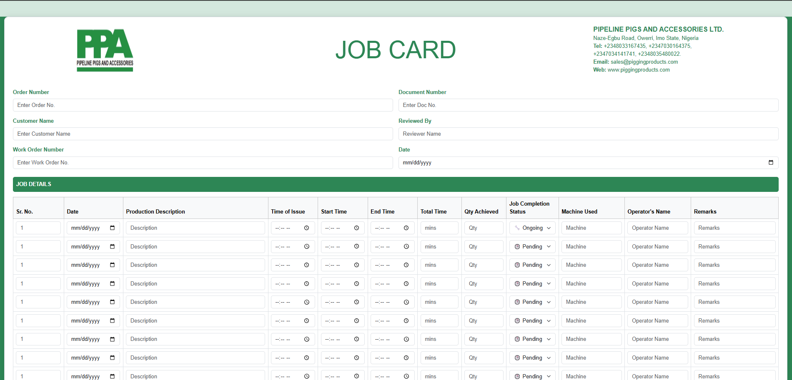
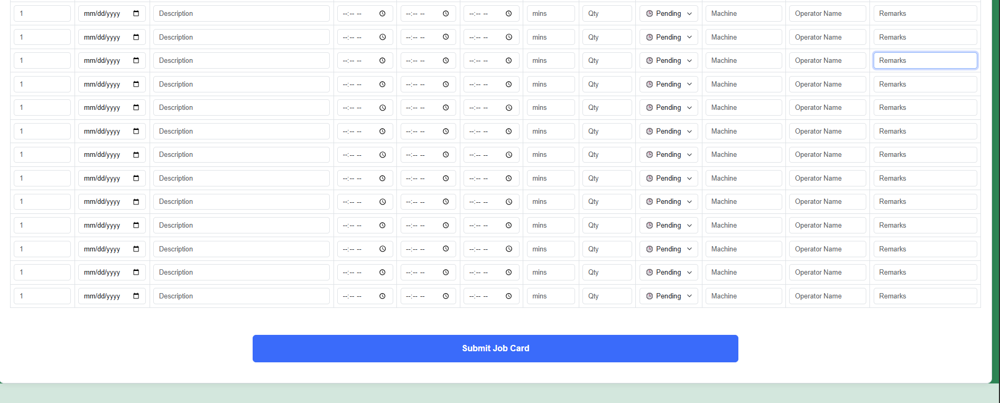

# 🛠️ PPA Job Card Web Form


## 📋 Description

**Responsive Bootstrap 5 Job Card Form for Production Tracking and Workflow Management**
This project is a responsive web-based **Job Card Form** built with **Bootstrap 5.3**, designed for **PIPELINE PIGS AND ACCESSORIES LTD.** to document and manage production activities.

It features structured job documentation, production tracking, and status monitoring through a scrollable and interactive layout.

---

## 📄 Features

### ✅ Company Header Section

* Company logo and contact information displayed clearly.
* Responsive layout with a center-aligned title and two side columns.

### ✅ Input Header Fields

* Order Number, Document Number
* Customer Name, Reviewed By
* Work Order Number, Date

### ✅ Dynamic Job Table

* Input for 20+ production records.
* Fields include:

  * Sr. No., Date, Production Description
  * Time of Issue, Start/End Time, Total Time
  * Quantity Achieved
  * Job Completion Status: `🕒 Pending`, `🔧 Ongoing`, `✅ Completed`
  * Machine Used, Operator Name, Remarks

### ✅ Responsive Table Design

* Optimized using Bootstrap table and grid utilities.
* Adjusted column widths for better content distribution.

### ✅ Submit Section

* Prominent submit button (`btn-lg`, `w-50`) centered with extra padding.

---

## 🛠 Tech Stack

| Tool/Framework | Version | Purpose                   |
| -------------- | ------- | ------------------------- |
| Bootstrap      | 5.3.3   | Frontend layout & styling |
| HTML5          | ✅       | Markup structure          |
| CSS            | ✅       | Optional styling          |
| JS Bundle      | ✅       | Bootstrap interactivity   |

---

## 💡 Usage

1. **Clone the repository**

   ```bash
   git clone https://github.com/yourusername/ppa-job-card-bootstrap-form.git
   ```

2. **Navigate to the folder**

   ```bash
   cd ppa-job-card-bootstrap-form
   ```

3. **Open `index.html` in your browser**

   > Customize logo or fields as needed.

4. **Optional:** Add backend or JS scripts for form processing.

---

## 📦 Folder Structure

```
📁 ppa-job-card-bootstrap-form
├── index.html         # Main job card form
├── style.css          # Optional custom styles
└── img/
    ├── logo.png       # Company logo
    ├── shot1.png      # Table screenshot
    └── shot2.png      # Signature section screenshot
```

---

## 🖼️ Screenshots

### ✅ Form Header & Branding


### ✅ Job Entry Table



### ✅ Signatory Section



---

## 🏷️ Tags

`#JobCard` `#BootstrapForm` `#ProductionTracking` `#HTML5` `#Bootstrap5` `#PipelinePigs` `#ResponsiveDesign` `#Nigeria` `#ManufacturingForm` `#ManufacturingWorkflow` `#WorkOrderManagement` `#ProductionSheet`

---

## 👤 Company Info

**PIPELINE PIGS AND ACCESSORIES LTD.**
📍 Naze-Egbu Road, Owerri, Imo State, Nigeria
📞 +2348033167435, +2347030164375, +2347034141741, +2348035480022
📧 [sales@piggingproducts.com](mailto:sales@piggingproducts.com)
🌐 [www.piggingproducts.com](http://www.piggingproducts.com)

---

© 2025 PIPELINE PIGS AND ACCESSORIES LTD. All rights reserved.
